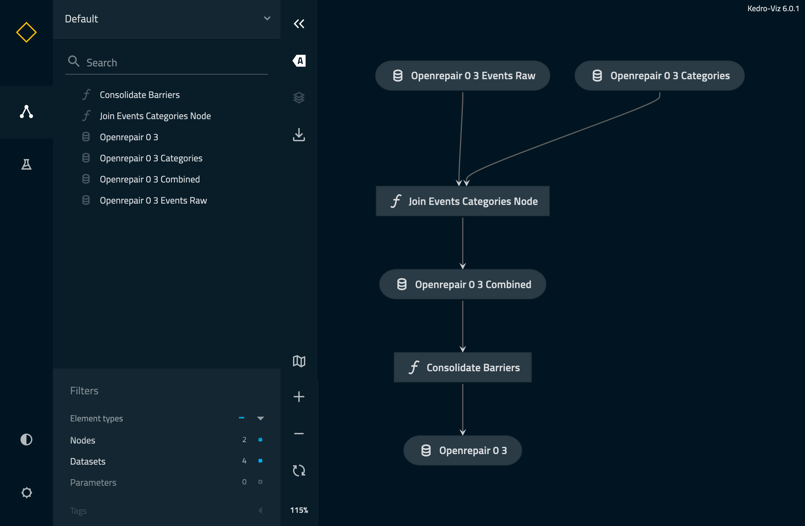
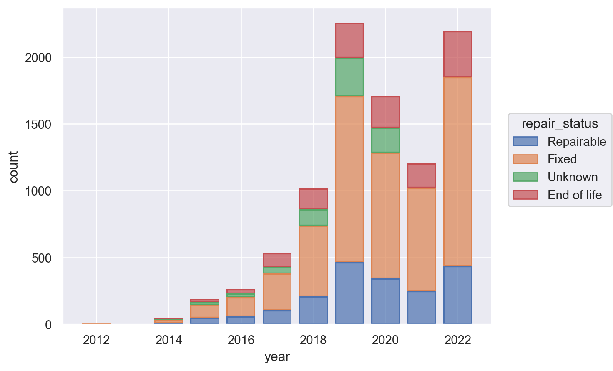

# Workshop "Refactor your Jupyter notebooks into maintainable data science code with Kedro"

> You're a Machine Learning Engineer that has just arrived to an existing project.
> The Data Scientist has given you a seemingly working notebook,
> and now it's your task to refactor it appropriately
> so that the analysis is more reproducible and the process is easier to deploy to production.
> For that, you will first verify that everything is working,
> and then convert the notebook to a Kedro project.

[](https://gitpod.io/#https://github.com/astrojuanlu/workshop-jupyter-kedro/)

What's the starting point?

- Some data
- A notebook analyzing it
- The needed requirements to get it working

## Steps

### Get started and assess the baseline

1. **Download the data**. Fill the form at https://openrepair.org/open-data/downloads/ or use [the direct URL](https://openrepair.org/wp-content/uploads/2023/02/OpenRepairData_v0.3_aggregate_202210.zip). Extract all the files and place them under the `data/` directory.
2. **Setup your development environment**. Create a conda/mamba environment called `repair310` with Python 3.10, activate it, and install the dependencies from `requirements.txt` using pip.
3. **Verify that everything works**. Run the notebook top to bottom. How many rows does the repair events dataset have?

Success! 🎉 You can now start working on the project for real. The fun starts now.
### Refactor data loading using the catalog

1. You will need a "bleeding edge" version of `kedro` to proceed. Add `kedro @ git+https://github.com/kedro-org/kedro@3ea7231` to `requirements.txt` and install it. Verify that `kedro info` works.
2. Add `kedro-datasets[pandas.CSVDataSet,polars.CSVDataSet]==1.3.0` to `requirements.txt`, and install it.
3. Create a `data/01_raw` directory, and move all the data files there.
4. Create `conf/base` and `conf/local` directories, as well as a `conf/base/catalog.yml` file, and register the events dataset as follows:

```yaml
# conf/base/catalog.yml

openrepair-0_3-events-raw:
  type: polars.CSVDataSet
  filepath: data/01_raw/OpenRepairData_v0.3_aggregate_202210.csv
  load_args:
    dtypes:
      product_age: ${pl_Float64}
      group_identifier: ${pl_Utf8}
    try_parse_dates: true
```

4. Add the following code snippet at the beginning of the notebook to use the Kedro catalog for data loading:

```python
from kedro.config import TemplatedConfigLoader
from kedro.io import DataCatalog

catalog_variables = {
    "pl_Float64": pl.Float64,
    "pl_Utf8": pl.Utf8,
}

conf_loader = TemplatedConfigLoader("conf", globals_dict=catalog_variables)
conf_catalog = conf_loader.get("catalog.yml")
catalog = DataCatalog.from_config(conf_catalog)
```

5. Finally, replace the `df = pl.read_csv(...)` call with `df = catalog.load("openrepair-0_3-events-raw")`. Verify that everything works.
6. Do the same with the categories `DataFrame`: register it in the `conf/base/catalog.yml` and replace the `categories = pl.read_csv(...)` with the appropriate `categories = catalog.load("...")` call.

Success! 🎉 After adding some Kedro boilerplate, you decoupled the Jupyter notebook from the actual file locations and loading options.
In addition, you prepared the project structure to accommodate intermediate datasets.
There is still some work to do, but you are getting there.

### Turn the code into a Python library

1. Install `flit` using `pip`, and run `flit init` to create a `pyproject.toml` file with the appropriate project metadata. Answer the wizard as follows:

```
Module name: openrepair
Author: (Your name)
Author email: (Your email)
Home page: (Anything, or blank)
Choose a license (see http://choosealicense.com/ for more info)
1. MIT - simple and permissive
2. Apache - explicitly grants patent rights
3. GPL - ensures that code based on this is shared with the same terms
4. Skip - choose a license later
Enter 1-4 [4]: 4
```

2. Create a `src/openrepair` directory, and place these contents in `src/openrepair/__init__.py`:

```python
# src/openrepair/__init__.py

"""
OpenRepair data analysis library code.
"""

__version__ = "0.1.0"
```

3. Verify that the project can be installed as a Python library running `pip install --editable .`.
4. Add the Kedro build configuration to `pyproject.toml`:

```toml
# pyproject.toml

[tool.kedro]
package_name = "openrepair"
project_name = "openrepair"
kedro_init_version = "0.18.8"
```

Verify that `kedro --help` shows a new section called "Project specific commands from Kedro".

5. Add the Kedro application configuration to a new file `src/openrepair/settings.py`:

```python
from kedro.config import TemplatedConfigLoader

import polars as pl

CONFIG_LOADER_CLASS = TemplatedConfigLoader
CONFIG_LOADER_ARGS = {
    "globals_dict": {
        "pl_Float64": pl.Float64,
        "pl_Utf8": pl.Utf8,
    },
}
```

6. Go back to the notebook, and replace the catalog initialization by this line: `%load_ext kedro.ipython`. Verify that everything works.

Success! 🎉 You created a basic Python library, which will serve as the blueprint for all the reusable code you will write. You are done with the boilerplate and are ready to start leveraging the power of Kedro.

### Create a data processing pipeline

1. Create a new data processing pipeline by running `kedro pipeline create data_processing`.
2. Turn the code that joins the two `DataFrames` and cleans the result into Python functions by adding this to `src/openrepair/pipelines/data_processing/nodes.py`:

```python
# src/openrepair/pipelines/data_processing/nodes.py

import polars as pl


def join_events_categories(events: pl.DataFrame, categories: pl.DataFrame):
    df_clean = events.select(pl.all().exclude("product_category")).join(
        categories, on="product_category_id"
    )
    return df_clean


def consolidate_barriers(df_clean: pl.DataFrame):
    return df_clean.with_columns(
        pl.col("repair_barrier_if_end_of_life").map_dict(
            {"Item too worn out": "Product too worn out"},
            default=pl.col("repair_barrier_if_end_of_life"),
        )
    )
```

3. Craft the pipeline by modifying `src/openrepair/pipelines/data_processing/pipeline.py` as follows:

```python
# src/openrepair/pipelines/data_processing/pipeline.py

from .nodes import join_events_categories, consolidate_barriers


def create_pipeline(**kwargs) -> Pipeline:
    return pipeline(
        [
            node(
                func=join_events_categories,
                inputs=["openrepair-0_3-events-raw", "openrepair-0_3-categories"],
                outputs="openrepair-0_3-combined",
                name="join_events_categories_node",
            ),
            node(
                func=consolidate_barriers,
                inputs="openrepair-0_3-combined",
                outputs="openrepair-0_3",
                name="consolidate_barriers",
            ),
        ]
    )
```

4. Register the pipeline by creating a `src/openrepair/pipeline_registry.py` module with these contents:

```python
# src/openrepair/pipeline_registry.py

"""Project pipelines."""
from kedro.framework.project import find_pipelines
from kedro.pipeline import Pipeline


def register_pipelines() -> dict[str, Pipeline]:
    """Register the project's pipelines.

    Returns:
        A mapping from pipeline names to ``Pipeline`` objects.
    """
    pipelines = find_pipelines()
    pipelines["__default__"] = sum(pipelines.values())
    return pipelines
```

Verify that `kedro registry list` shows a `__default__` pipeline as well as the data processing one.

5. Add `kedro-viz` to `requirements.txt` and install it. After that, run `kedro viz`, and wait for the web interface to open.

Success! 🎉 You just created your first Kedro pipeline and now you can see it as a beautiful directed acyclic graph (DAG).
Now it's time to actually save those intermediate results to disk.



### Open ended: Refine your pipeline and visualize artifacts

1. Register the intermediate datasets used in the data processing nodes by adding these contents to `conf/base/catalog.yml`:

```yaml
# conf/base/catalog.yml

openrepair-0_3-combined:
  type: polars.CSVDataSet
  filepath: data/02_intermediate/openrepairdata_v0.3_combined.csv
  load_args:
    dtypes:
      product_age: ${pl_Float64}
      group_identifier: ${pl_Utf8}
    try_parse_dates: true

openrepair-0_3:
  type: polars.CSVDataSet
  filepath: data/03_primary/openrepairdata_v0.3_clean.csv
  load_args:
    dtypes:
      product_age: ${pl_Float64}
      group_identifier: ${pl_Utf8}
    try_parse_dates: true
```

2. Run the pipeline by running `kedro run`. Verify that a `data/03_primary/openrepairdata_v0.3_clean.csv` file appeared on the filesystem.
3. Create a `notebooks` directory, and move the EDA notebook there.
4. Add a new `notebooks/data-science.ipynb` notebook and, using the `kedro.ipython` extension and the `catalog`, load the `openrepair-0_3` and extract insights from it. For example, here is a plot of the repair statuses by year:



## Resources

- Kedro documentation: https://docs.kedro.org/

## Cheatsheet

```bash
# Create a mamba environment using micromamba (you can replace micromamba with mamba or conda)
# Replace $VARIABLES with actual parameters or give them a value
$ micromamba create -n $ENV_NAME python=$PY_VERSION -c conda-forge

# Activate a mamba environment using micromamba (you can replace micromamba with mamba or conda)
$ micromamba activate $NEV_NAME

# Install dependencies from `requirements.txt` file using pip
$ pip install -r requirements.txt
```
